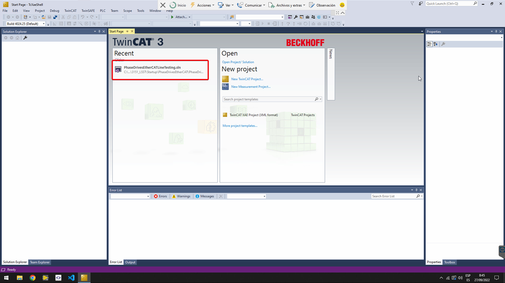
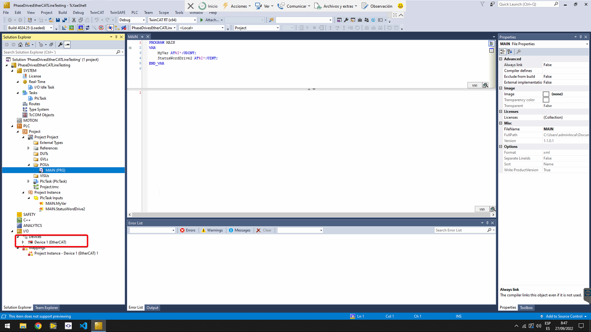
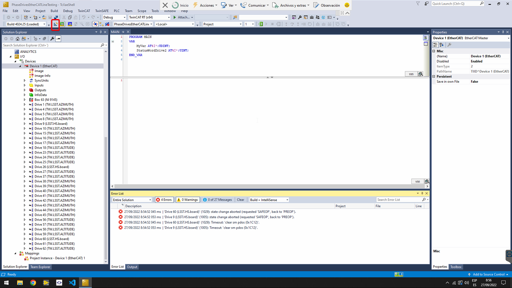
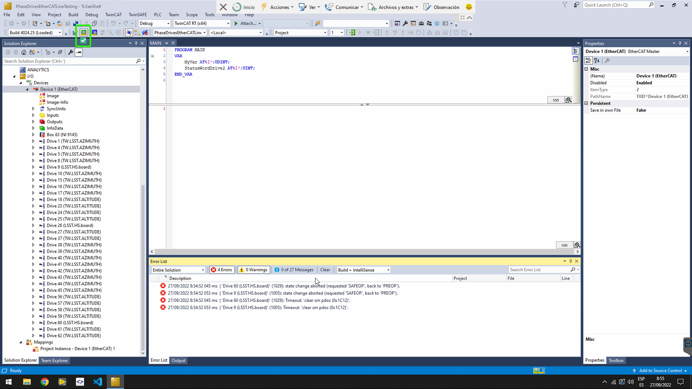
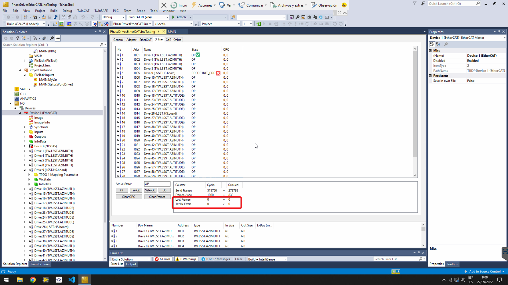
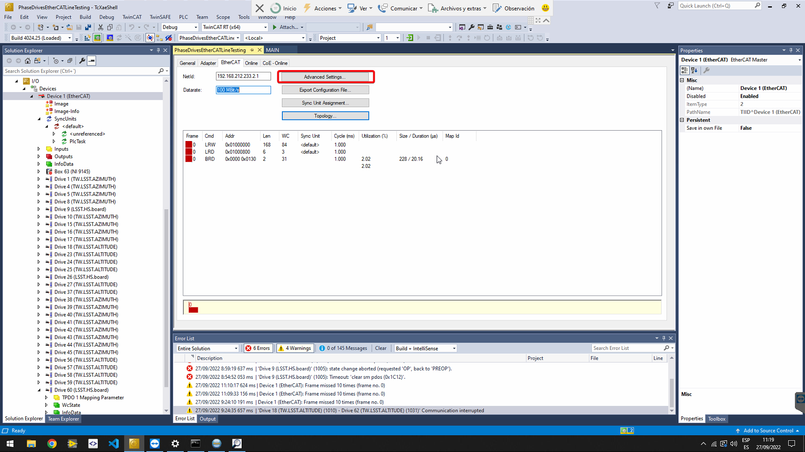

# EtherCATLineDiagnostic

| **Requested by:** | **GHESA** |
| ----------------------- | --------------- |
| **Doc. Code**     | --              |
| **Editor:**       | Alberto Izpizua |
| **Approved by:**  | Julen García   |

## Introduction

This repository has the documentation to diagnose the EtherCAT lines in the TMA. Also the TwinCAT solutions to perform the diagnose are included in the repository.

In the "TwinCATProjects\PowerSupplyAndIOs\PowerSupplyAndIOs" folder is located the solution for Phase Power Supply and remote IOs EtherCAT line.

In the "TwinCATProjects\PhaseDrivesEtherCATLineTesting" folder is located the solution for main axes drives EtherCAT line

This document shows a simple overview of the TwinCAT 3 tool used to diagnose the EtherCAT line. This document has not the intention to instruct any person on deep understanding of the TwinCAT 3 tool for any use. This document is only for reference of the work done in the EtherCAT line diagnosis.

The described use, and the project used is only valid for the Phase Main Drives EtherCAT line. It is not valid for the secondary EtherCAT line, the one with the remote I/Os and the Power Supply.

## Reference document list

| No. | Document | Code | Version |
| --- | -------- | ---- | ------- |

## Technical description

### Hardware connection

To diagnose the EtherCAT line the windows computer sent by Tekniker for early validation and remote support is used. This computer has the possibility to act as an EtherCAT master, as a real time capable ethernet adapter is the integrated in it (it is labelled as MainPort).

There are two options for the hardware connection depending if the diagnosis is going to be done in the drives line or the IOs and Phase Power supply line

#### Drives EtherCAT line

Connections to test this line are:

1. Remove the cable, 10CS_205A, wired to the output of the cRIO, 201A1, located in the TMA-AZ-MCS-CBT-0001.
2. Wire the 10CS_205A cable to the Ethernet link of the computer labelled as MainPort.

#### Remote IOs and Phase Power supply EtherCAT line

Connections to test this line are:

1. Remove the 221W1 cable from the 220A1 element
2. Connect an Ethernet Cable between the Ethernet link of the computer labelled as Main port and the free port in the 220A1.

{width=40%}

### TwiCAT

The tool that is used to diagnose is TwinCAT 3 by Beckhoff. In the following lines the use of this tool is briefly described.

1. Open TwinCAT. There are two options:

   - In the right side of the windows toolbar find the TwinCAT runtime icon, and right click on it to select the TwinCAT XAE (TcXaeShell)

   

   

   - In the Windows start, search for TwinCAT XAE Shell

   
2. Open the Project created for the diagnosis of the  EtherCAT line

   - For the drives EtherCAT line use the "PhaseDriveEtherCATLineTesting.sln" solution.
   - For the IOs and the Power Supply use the "PowerSupplyAndIOs.sln" solution.

   
3. In the Solution Explorer, in I/ODevicesDevice 1 click on the arrow to show the entire EtherCAT line

   
4. Check that the assigned NIC for the EtherCAT master is the IntegratedEthernet in the adapter tab.

If the selected NIC is the Integrated Ethernet continue with step 5, otherwise make the next substeps:

- Click in the the search button to change the NIC

- Select the IntegratedEthernet (TwinCAT intel PCI Ethernet Adapter (Gigabit)V2)

5. Only for drives EtherCAT line. Ensure that the Box 63 corresponding to the cRIO 9145 is disabled. The EtherCAT line starts just after the cRIO. If it is not disabled, right click on it, and select Disable in the context menu.

   

   
6. Activate configuration using the button in the toolbar

   
7. Click OK on the next dialog

   
8. If asked for trial licenses, click on yes and copy the shown characters in the next window.

   
   
9. It takes some time to load the project and start the system. After this time check that the TwinCAT system is in Run Mode.

   
10. Check that all slaves are in OP state (this means operational state), by selecting Device 1 (the EtherCAT master) from the solution explorer on the left pane and go to the Online tab.

    

    If all slaves are NOT in OP state, try next options:

    - Change to configuration mode (button next to the Run Mode) and then to run mode again.
    - Go to the slave that is not in OP mode in the Solution Explorer and click on it. Find the online view and manage the state machine of the slave with the buttons. To clear errors properly, it is best to put the slave in Init state.

    
11. To display more diagnostics, select the EtherCAT master from the solution explorer (left side of the window) and go to EtherCAT tab. There Click on Advanced Settings….

    
12. Go to Diagnosis->Online View tab and select:

    - Select Show Change Counters (State Changes / Not Present).  Add the Changes column in the Online tab showing two counters separated by a slash. The first counter shows the number of abnormal state transitions. The second counter shows how often the communication with the slave device has been interrupted.
    - In the blue box, shown in next figure, check next topics. Those should be counters in the slaves, but they depends on the slave implementation
    - 300 ‘CRC A’. Byte 300 is Frame Error Counter port A and Byte 301 is Physical Layer Error Counter port A. Two bytes could also be a RX Error Counter for port A.
    - 302 ‘CRC B’. Byte 302 is Frame Error Counter port B and Byte 303 is Physical Layer Error Counter port B. Two bytes could also be a RX Error Counter for port B.
    - 304 ‘CRC C’. Byte 304 is Frame Error Counter port C and Byte 305 is Physical Layer Error Counter port C. Two bytes could also be a RX Error Counter for port C.
    - 306 ‘CRC D’. Byte 306 is Frame Error Counter port D and Byte 307 is Physical Layer Error Counter port D. Two bytes could also be a RX Error Counter for port D.
    - 310 ‘Link Lost A/B’. Lost Link Counter port A and B. The 310 byte is for port A while the 311 byte is for port B.
    - 312 ‘Link Lost C/D’. Lost Link Counter port C and D. The 312 byte is for port C while the 313 byte is for port D.

## Results

The following results are only for the first test made in the EtherCAT line by Tekniker. Any other test is outside Tekniker’s scope (even this one is outside).

The test started on 2022/09/27 at 10:00 Chile time. The results on 2022/09/28 at 3:50 Chile time are shown in figure bellow (the computer time was 1 hour behind the actual Chile time).
It can be shown that there are several Lost Frames, as well as Tx/Rx Errors. Those counters should be at zero or at very low number (less than 5) after only 18 hours. It is also noticeable that the slaves changed their state for 147 times (this number should be 1), for the first 9 slaves and 153 for next slaves. This means that the line went down completely for 146 and partially down for 152.
The 310 register shows a number for slaves 9 and 10. This register should be a counter, but is constant during the 18 hours test. As this register is managed by the slave, this behavior must be checked with Phase.
The CRC shows a 11 for the input in slave 10. This counter is reseted every time the system is restarted (147 times shown in the Changes column).
After locking for a while to the online tab, it can be appreciated that the state of all the slaves disappear (connection lost) and then start the line again starting with Init state. This is coherent with the number 147 shown in Changes column.
Also the Reg 300 for slave 10 could be appreciated to flash when the CRC for this slave increases. This register should be a counter, but the implementation of this register must be checked with Phase.

## ANNEX 1. Slave modules ESI files

To discover the modules and to work properly the ESI files for the Phase slaves and for Phoenix Contact slaves must be located in the Beckhoff folder designated to allocate ESI files.

C:\TwinCAT\3.1\Config\Io\EtherCAT

ESI files could be located in the [labview pxi controller](https://github.com/lsst-ts/ts_tma_labview_pxi-controller) repository inside the "ESIFiles/Phoenix" and "ESIFiles/Phase/lsst_xml" folders.

## ANNEX 2. BIOS configuration

The Beckhoff master need to disable the virtualization in the BIOS. To access the BIOS reboot the computer and when it start switching on the system press F2 to access the BIOS.

